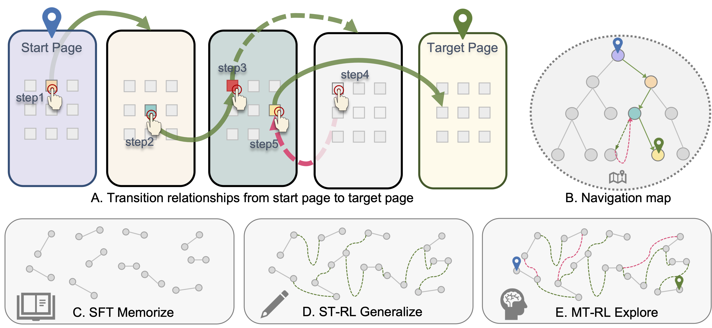
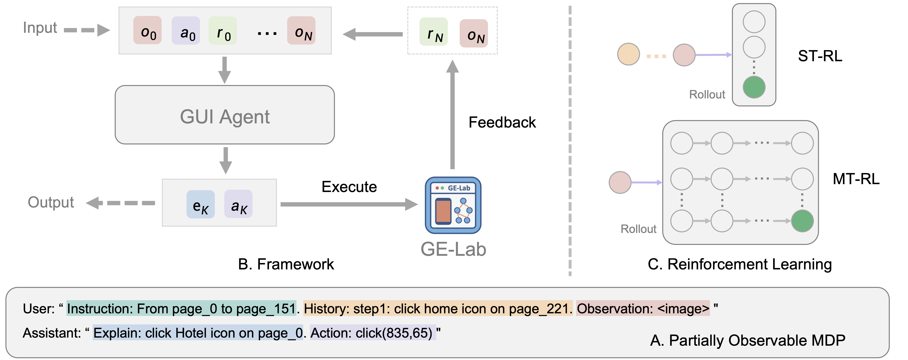
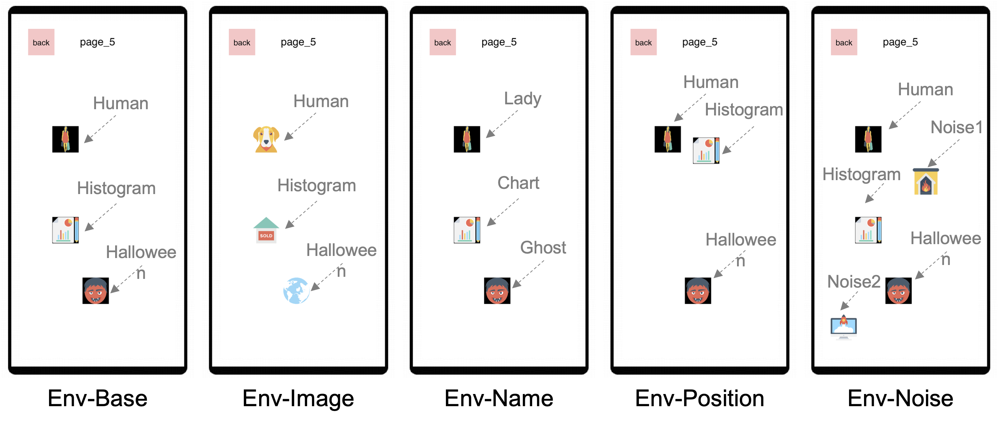
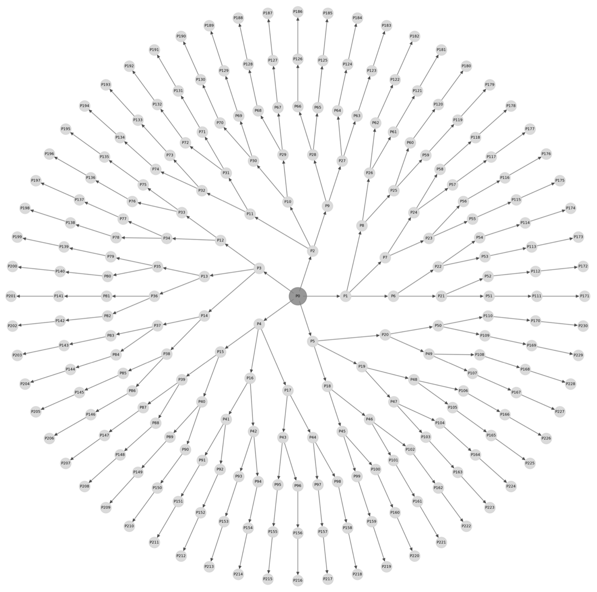
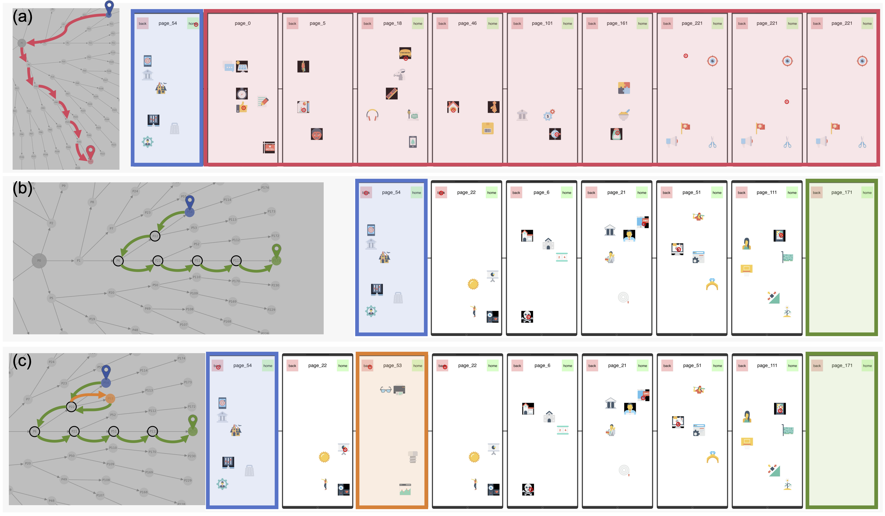
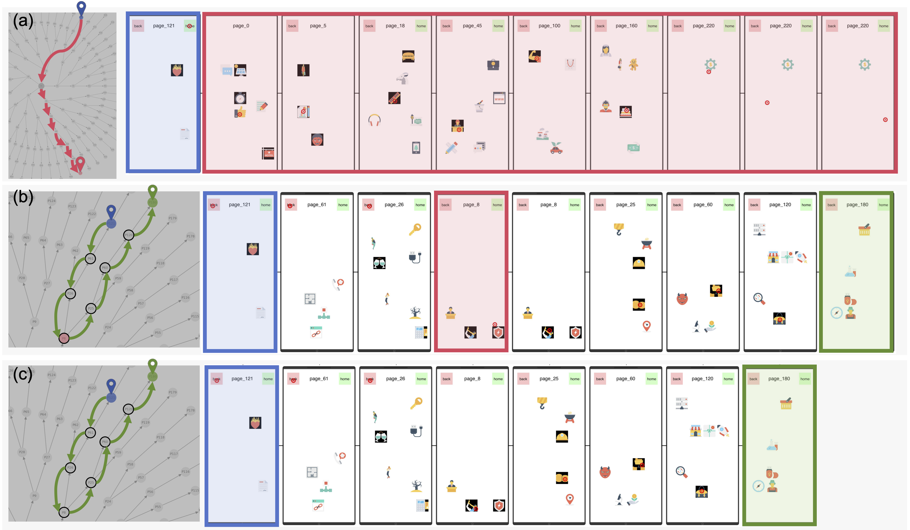
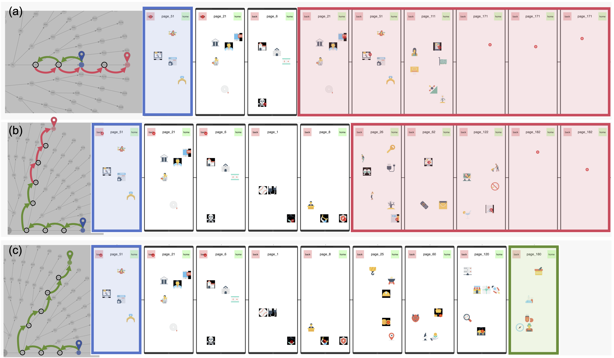

<h1 align="center">GUI Exploration Lab: Enhancing Screen Navigation in Agents via Multi-Turn Reinforcement Learning</h1>

<p align="center">
  
</p>

<p align="center">
  <a href="https://arxiv.org/abs/XXXX.XXXXX"></a>
  <a href="https://github.com/summoneryhl/GE-Lab"></a>
</p>

GUI Exploration Lab (GE-Lab) is a simulation environment for GUI agent navigation research. It enables flexible definition of screens, icons, and inter-screen navigation graphs, while providing full access to environment information for comprehensive training, evaluation, and analysis. Building on this environment, we study a three-stage training pipeline—Supervised Fine-Tuning (SFT), Single-Turn Reinforcement Learning (ST-RL), and Multi-Turn Reinforcement Learning (MT-RL)—to enhance agents’ screen navigation capabilities.

## Overview

<p align="center">
  
</p>

Real GUI environments (desktop software, mobile apps, web apps) are complex and often proprietary, making it hard to obtain complete, structured environment information for agent training and evaluation. GE-Lab addresses this by providing a controllable, fully observable GUI simulation environment for:

- Precise access to screen layout, icon semantics, and transition graph.
- Systematic training/evaluation of navigation and exploration strategies.
- Controlled studies of generalization and error recovery.


<!-- Introduction: image right, text left -->
<div style="overflow:auto;">
  <p>
    GE-Lab frames GUI agent research around multi-step screen navigation. As LVLMs excel at single-screen grounding,
    the remaining challenge is navigating complex screen graphs to reach target states. Our work studies a three-stage
    training pipeline to strengthen navigation: Supervised Fine-Tuning (SFT) for fundamentals, Single-Turn RL (ST-RL)
    for generalization, and Multi-Turn RL (MT-RL) for exploration and error recovery.
  </p>
</div>
<br clear="both"/>

<!-- Training Pipeline: image left, text right -->
<div style="overflow:auto;">
  <h3>Training Pipeline</h3>
  
  <p>
    The three-stage pipeline builds progressively: SFT memorizes core GUI skills; ST-RL improves generalization with rule-based rewards; MT-RL encourages multi-step exploration and recovery via interactive trial-and-error.
  </p>
</div>
<br clear="both"/>

<!-- Environment: image right, text left -->
<div style="overflow:auto;">
  <h3>Environment & Navigation Graph</h3>
  <div style="display: flex; align-items: center; justify-content: center; width: 80%; margin: 0 auto;">
    
    
  </div>
  <p>
    GE-Lab provides a fully observable synthetic GUI environment: configurable screens, icons, and an explicit inter-screen transition graph. It enables precise access to layouts and semantics for reproducible training, evaluation, and analysis of navigation strategies.
  </p>

  <p>
    Screens are connected via a navigation graph. Icons trigger transitions, supporting studies of shortest-path navigation, redundant trajectories, and controlled generalization experiments.
  </p>
</div>
<br clear="both"/>


<!-- Case Studies: overview image left, then alternating per case -->
<div style="overflow:auto;">
  <h3>Cases</h3>
  <h4>Case 1: Basic Navigation and Recovery</h4>
  
  <p>
    SFT fails off-path and gets stuck; ST-RL finds the shortest path; MT-RL recovers after a misstep using backtracking
    and completes the task.
  </p>

  <h4>Case 2: Precision and Efficiency</h4>
  
  <p>
    SFT repeatedly clicks invalid areas; ST-RL corrects in-state after an initial mistake; MT-RL executes a flawless
    shortest path.
  </p>
  
  <h4>Case 3: Complex Navigation and Novel Path Discovery</h4>
  
  <p>
    SFT and ST-RL fail on longer sequences; MT-RL discovers a novel multi-step path to the target, demonstrating
    stronger exploration and generalization.
  </p>

</div>
<br clear="both"/>

## Key Features

- Fully observable synthetic GUI environment for reproducible research.
- Flexible graph-based navigation specification for multi-step tasks.
- Rule-based rewards to train LVLM-powered agents.
- Supports studies on generalization, exploration, and error recovery.

## Get Started

This project has two main parts:
- `data_engine/` – environment setup and synthetic UI generation
- project root – training (SFT, ST‑RL, MT‑RL) and evaluation

Follow the steps below to generate an environment, train models, and evaluate.

- Setup and install
  - `pip install -e .`
  - Optional: set `WANDB_API_KEY` or use `--report_to none` to disable logging

- Generate a synthetic GUI environment
  - `cd data_engine`
  - Place icon assets under `data_engine/icons/` and ensure `data_engine/font/helvetica.ttf` exists
  - Run: `python tree.py`
  - Outputs (timestamped under `data_engine/ui_environment/`): `ui_structure.json`, `ui_structure_layer.json`, `pages/`, `ui_topology.png`

- Train (multi‑node scripts or single‑GPU commands)
  - `chmod +x gui_scripts/*.sh`
  - SFT: `./gui_scripts/sft.sh`
  - ST‑RL: `./gui_scripts/single_turn_rl.sh`
  - MT‑RL: `./gui_scripts/multi_turn_rl.sh`
  - Single‑GPU examples:
    ```bash
    # SFT training
    swift sft --model <MODEL_PATH> \
        --dataset datas/sft.json \
        --train_type full \
        --torch_dtype bfloat16 \
        --num_train_epochs 1 \
        --per_device_train_batch_size 2 \
        --output_dir checkpoint/gui_exp/sft \
        --report_to none

    # ST-RL training
    swift rlhf --rlhf_type grpo \
        --model <MODEL_PATH> \
        --dataset datas/st_rl.json \
        --reward_funcs web_action_match web_coordinate_match web_intent_match \
        --num_train_epochs 1 \
        --per_device_train_batch_size 2 \
        --output_dir checkpoint/gui_exp/st_rl \
        --report_to none

    # MT-RL training
    swift rlhf --rlhf_type grpo \
        --model <MODEL_PATH> \
        --dataset datas/mt_rl.json \
        --reward_funcs a2b \
        --num_train_epochs 1 \
        --per_device_train_batch_size 2 \
        --output_dir checkpoint/gui_exp/mt_rl \
        --report_to none
    ```

- Evaluate
  - Generate predictions:
    ```bash
    python eval/inference_qwen2p5_mixed_vllm.py \
        --model_path <checkpoint_or_model> \
        --test_file datas/test.json \
        --savefile result.json
    ```
  - Compute metrics: 
    ```bash
    python eval/calculate_score_refine.py --file result.json
    ```
  

- Notes
- Update dataset paths if you create custom data; see `datas/*.json` for formats
- Checkpoints default to `checkpoint/gui_exp/<run_name>`; logs under `logs/train`
- If `rlaunch` or multi‑node isn’t available, prefer the single‑GPU `swift` commands

### Prepare Your Own Dataset (Minimal Examples)

Datasets are simple JSON files. Below are small examples for each stage placed under `datas/`.

- SFT (`datas/sft.json`): conversation-style pairs with images
  ```json
  [
    {
      "idx": 0,
      "task": "From page_161 to page_216",
      "messages": [
        { "role": "user", "content": "<image>Instruction: from page_161 to page_216. History: Null" },
        { "role": "assistant", "content": "Explain:click home icon on page_161.\tAction: click(start_box='<|box_start|>(850,69)<|box_end|>')" }
      ],
      "images": ["datas/images/page_161.png"],
      "source": "sub4"
    }
  ]
  ```

- ST‑RL (`datas/st_rl.json`): single‑turn items with problem/solution and an image
  ```json
  [
    {
      "idx": 0,
      "image": "datas/images/page_3.png",
      "problem": "<image>Instruction: from page_3 to page_12. History: Null",
      "solution": "explain:click Flowers_and_plants_153 icon on page_3.\tAction: click(start_box='<|box_start|>(503,522)<|box_end|>')",
      "bbox_norm": [402, 492, 572, 570],
      "source": "sub3_edge"
    }
  ]
  ```

- MT‑RL (`datas/mt_rl.json`): similar to ST‑RL but used for multi‑turn exploration/rewards
  ```json
  [
    {
      "idx": 0,
      "task": "From page_3 to page_12",
      "image": "datas/images/page_3.png",
      "problem": "<image>Instruction: from page_3 to page_12. History: Null",
      "solution": "Explain:click Flowers_and_plants_153 icon on page_3.\tAction: click(start_box='<|box_start|>(472,513)<|box_end|>')",
      "bbox_norm": [402, 492, 572, 570],
      "source": "sub3"
    }
  ]
  ```

Tips
- Ensure image paths are valid; sample images are under `datas/images/`.
- The `Action` string carries coordinates in a `'<|box_start|>(x,y)<|box_end|>'` format expected by scripts.

<!-- ## Results Summary

- SFT effectively memorizes foundational GUI skills but has limited OOD generalization.
- ST-RL improves generalization and stability across seeds with monotonic convergence.
- MT-RL encourages exploration and error recovery, discovering viable multi-step paths unseen during SFT. -->


## Acknowledgements

This work builds on progress in LVLMs and GUI agent research, and draws inspiration from reinforcement learning environments such as OpenAI Gym and task suites used in AndroidWorld. We thank the ModelScope team for their ms-swift training framework, which provided essential infrastructure for our model training pipeline.


## Citation

If you find GE-Lab useful for your research, please consider citing our work :)

```bibtex
@inproceedings{yangui,
  title={GUI Exploration Lab: Enhancing Screen Navigation in Agents via Multi-Turn Reinforcement Learning},
  author={Yan, Haolong and Shen, Yeqing and Huang, Xin and Wang, Jia and Tan, Kaijun and Liang, Zhixuan and Li, Hongxin and Ge, Zheng and Yoshie, Osamu and Li, Si and others},
  booktitle={The Thirty-ninth Annual Conference on Neural Information Processing Systems}
}
```
